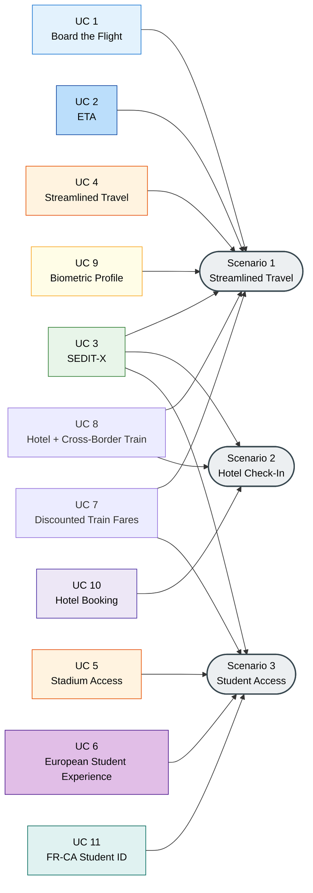

## Overview and Use Case Mapping

This section provides the cross-cutting view of the 11 accepted WP4 use cases. The material is organised in three parts: a short recap of the three WP4 scenarios, a consolidated mapping of the 11 use cases to these scenarios, a short visual of the mapping, and a brief account of the interfacing points with WP3 and WP6.

### The three WP4 scenarios, in more detail

The Grant Agreement defines three scenarios for WP4. Each scenario is a coherent end-to-end user journey that the EUDIW is expected to simplify and make portable across Member States. The descriptions below expand on the summary given in Chapter 2 and Chapter 4.

**Scenario 1: Streamlined Travel Experience.** This is the broadest of the three scenarios. It covers the whole travel chain, from the moment the user books a trip to the moment they disembark at the destination. Within this chain, the EUDIW is used to hold and present travel documents (such as passport-derived credentials issued by WP3), boarding passes, and other tickets for air, rail, ferry, and urban transport. Where payment is part of the journey, the PBEE Framework developed by WP6 supports the transaction. The scenario is explicitly cross-border and includes support for travellers with special needs, who can present the relevant credentials from their wallet during the journey.

**Scenario 2: Hotel Check-In.** This scenario addresses the hospitality sector. It covers the full guest experience, from online booking to arrival at the property, with particular attention to the pain points of today's check-in process: manual data entry, physical handling of identity documents, long waiting times, inconsistent experiences across hotel chains, and national police-registration requirements that differ between Member States. The EUDIW is used to carry the booking confirmation, the PID, and any additional EAAs that the hotel requires (for example, a residence attestation for tax purposes).

**Scenario 3: Student Access.** This scenario focuses on the next-generation student card within the European Digital Identity portfolio. It covers the issuance of a student credential (such as the International Student ID Card, ISIC/GYSC, or the ERUA Alliance Card) to the EUDIW, the use of that credential to obtain student fares on bus and rail networks between European campuses, and the use of the same credential to access campus services, facilities, and discounts at the host institution. The scenario builds on networks and initiatives such as ERASMUS, European Universities, and EURAXESS, and aligns with the European Student Card Initiative.

### UC at a glance

The 11 WP4 use cases contribute to these three scenarios in a non-exclusive manner: several UCs span more than one scenario, a reflection of the fact that real user journeys combine travel, hospitality, and academic activities. The table below summarises the mapping. A filled circle (●) indicates that the UC is a primary contributor to the scenario; an open circle (○) indicates a secondary or optional contribution. The last two columns record the hand-off points with WP3 (Digital Travel Credentials) and WP6 (Payment and Banking EUDIW Extension Framework).

| UC | Title | Lead | S1: Streamlined Travel | S2: Hotel Check-In | S3: Student Access | WP3 (DTC) | WP6 (PBEE) |
|--|---|---|:---:|:---:|:---:|:---:|:---:|
| 1 | Board the Flight | Amadeus | ● | | | ● | |
| 2 | Electronic Travel Authorization (ETA) | Amadeus / Signicat| ● | | | ● | |
| 3 | SEDIT-X (multi-episode) | UAegean | ● | ● | ● | ● | ● |
| 4 | Streamlined Travel Experience | FastID | ● | | | ● | ○ |
| 5 | Stadium Access | FastID |  | | ● | ● |  |
| 6 | European Student Experience | iDAKTO / PagoPA | | | ● | | ● |
| 7 | Discounted Train Fares via EUDIW | PagoPA | ● | | ● | | ● |
| 8 | Overnight Hospitality & Cross-Border Train | PagoPA | ● | ● | | | ● |
| 9 | Biometric Profile for Seamless Airport Travel | IN Groupe | ● | | | ● | |
| 10 | Streamlined End-to-End Hotel Booking | IDnow | | ● | | | |
| 11 | France-Canada Student Digital Identity | SIROS Foundation | | | ● | | |

Several patterns are worth noting:

* **UC 3 (SEDIT-X)** is the only use case that contributes to all three scenarios. It is structured as a multi-episode journey, with Episode 1 (Smart Airport) and Episode 3 (Ferry Transport) sitting in Scenario 1, Episode 4 (Hospitality) sitting in Scenario 2, Episode 5 (Academic Access) sitting in Scenario 3, and Episode 2 (Urban Mobility in Athens) sitting across Scenarios 1 and 3 depending on whether the traveller is a generic visitor or a student at a Greek campus.
* **UC 7 and UC 8** act as bridge use cases: UC 7 sits at the intersection of rail travel (S1) and student mobility (S3), while UC 8 combines cross-border train travel (S1) with hotel check-in (S2).
* **UC 10** is the only pure-hospitality use case, and **UC 11** is the only use case that involves a non-EU Member State (Canada) as a credential-accepting party.

### Visual mapping

The diagram below represents the mapping between the 11 use cases and the three scenarios. Each arrow indicates a primary contribution of a use case to a scenario. Where a single use case contributes to more than one scenario, multiple arrows originate from the same UC node.

 The colour of each UC node reflects the UC lead, or pair of co-leads in the case of UC 2 (Amadeus + Signicat) and UC 6 (iDAKTO +   PagoPA). 

### Hand-off points with WP3 and WP6

The last two columns of the UC-to-scenario mapping table highlight the dependencies between WP4 and two other Work Packages. They are recalled here with a short explanation of what each hand-off entails in practice.

**Hand-off with WP3 (Digital Travel Credentials).** 5 use cases (UC 1, UC 2, UC 4, UC 9, and parts of UC 3 and UC 4) involve passengers whose passport data is held as a Digital Travel Credential in the EUDIW. WP3 is responsible for the issuance, verification, and lifecycle management of the DTC. WP4 consumes the DTC during boarding or travel-authorisation flows. The interface is defined once in the common technical foundations (Chapter 7) and reused by the individual UC specifications.

**Hand-off with WP6 (Payment and Banking EUDIW Extension Framework).** Several use cases include payment steps: paying for a taxi or ferry ride in SEDIT-X, paying for a train ticket at a discounted student fare (UC 7), paying for a hotel booking (UC 8), paying for urban mobility or event access (UC 5 as an optional extension). WP6 provides the PBEE Framework that standardises payment features across wallet implementations. WP4 consumes the PBEE Framework at the payment touchpoints of these use cases.

### Actor categories in WP4

The following section provides the **actor-centric view** of the WP4 pilot. The EUDIW ecosystem is, by design, multi-actor. A single use case typically involves a wallet holder, the Member State entity that provides the wallet, the national authority that issues the foundational identity credential, one or more private-sector credential issuers that issue sector-specific attestations, one or more relying parties that verify those attestations at the point of service, and a trust infrastructure that underpins all of this. Even the simplest WP4 use case engages at least five actor categories. More complex ones (for example, UC 3 SEDIT-X, with its five episodes) engage actors from all three WP4 scenarios and several Member States.

WP4 distinguishes between the following actor categories, aligned with the terminology of eIDAS 2.0 and the Architectural Reference Framework (ARF). Each category is defined in generic terms here; the concrete APTITUDE partners recorded in Annex @sec-Annex_A.

* **Wallet Holder.** The end user who carries the EUDIW and who uses it to hold, manage, and present credentials. In WP4, wallet holders take different user profiles depending on the use case: business travellers, tourists, hotel guests, students (ERASMUS or otherwise), event attendees, and travellers with reduced mobility.
* **Wallet Provider.** The Member State entity that provides the EUDIW to the wallet holder in compliance with eIDAS 2.0 and the Implementing Acts. WP4 does not produce wallets; it consumes wallet instances produced by participating Member States. The wallet provider is responsible for wallet activation, for the security of the wallet instance, and for the interfaces to PID and attestation providers.
* **PID Provider.** The national authority, or a delegate authorised by it, that issues the Person Identification Data into the wallet at the highest level of assurance, as mandated by Article 5b of eIDAS 2.0.
* **Credential Issuer.** The organisation that issues a sector-specific Electronic Attestation of Attributes (EAA) or its qualified counterpart (QEAA) into the wallet. Credential issuers in WP4 include airlines, travel distribution platforms, rail operators, ferry companies, urban mobility and bus operators, hotels, online travel agencies, student-card issuers such as the GYSC, the ERUA Alliance, universities, and event organisers.
* **Relying Party (Verifier).** The organisation that verifies a credential presented from the wallet in order to grant access to a service. In WP4, relying parties include airports, airlines at the gate, train operators, ferry boarding points, urban mobility operators, hotel front-desk and kiosk systems, campus access-control systems, stadium entry systems, and certain public authorities (for example, national guest-registration systems at the hospitality touchpoints).
* **Trust Service Provider.** The entity that provides trust services relied on by the WP4 actors, such as qualified certificates for electronic signatures and seals, qualified timestamps, and the qualified preservation of electronic signatures. Trust service providers typically do not appear in the foreground of a use case but underpin the signatures on PIDs, EAAs, and QEAAs.
* **Trust Authority and Trusted-List Operator.** The entity that operates the machinery through which PID providers, attestation providers, and relying parties are registered and through which trusted lists are published, in line with Implementing Regulation (EU) 2024/2980. Section 7.5 documents how WP4 relying parties consume these trusted lists.
* **Supervisory Body.** The national authority responsible for the supervision of the wallet provider, of the PID provider, and of the qualified trust service providers, under eIDAS 2.0. WP4 does not interact with supervisory bodies directly but operates within the framework they supervise.

In addition to these core categories, WP4 interacts with actors that do not fit neatly into the ARF roles but that are essential for the pilot:

* **Technology integrators and solution providers** that support credential issuers and relying parties in their integration with the wallet. Several APTITUDE partners play this role in the WP4 pilot.
* **Standardisation bodies and ecosystem groups** (such as the eIDAS Expert Group, the OpenID Foundation, ISO/IEC, ICAO, IATA) whose specifications frame the technical choices in Chapter 7. These actors do not operate the ecosystem but shape its rules; the engagement with them is documented in Sections @sec-3_2 and @sec-3_3.
* **Other APTITUDE Work Packages** (WP2, WP3, WP6, WP7) whose outputs WP4 consumes or contributes to. These Work Packages appear throughout the deliverable as institutional actors of APTITUDE rather than as ecosystem actors of the pilot itself; their relationship with WP4 is documented in Section @sec-2_3.

### Structure of the chapter

The remainder of Chapter 4 presents each of the 11 use cases in its own section, authored by the corresponding UC lead. The structure of each section follows the standardised template introduced in Section @sec-3_4, and the diagrams embedded in each section follow the mermaid diagrammatic standards.
