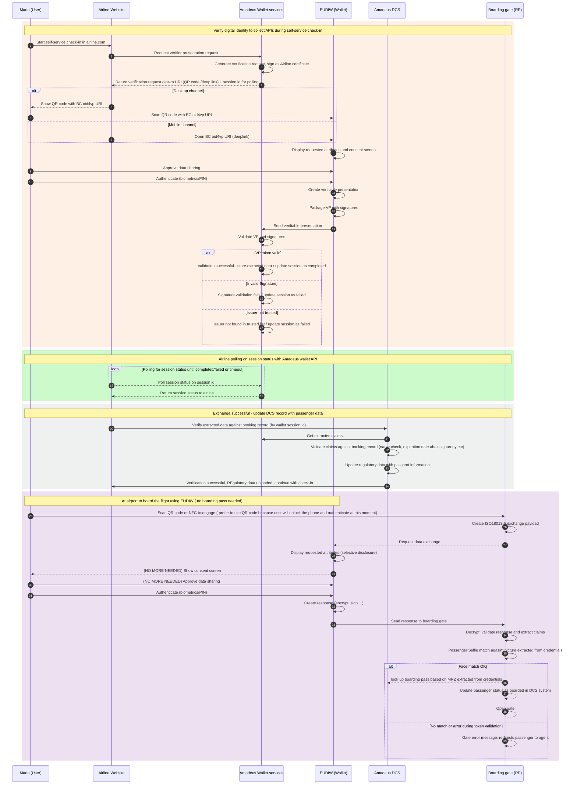

## UC 1: Board the flight (Amadeus)

### Use Case Summary

The **Board the Flight** use case demonstrates how the **EUDI Wallet** can support a continuous, privacy-preserving, and end-to-end air-travel passenger journey, from **online check-in** at home to **physical boarding at the airport gate**. 

The use case is designed around the principle that the traveller should be able to rely on the EUDI Wallet as a single, trusted interaction channel for **identity verification**, **regulatory data sharing (Advance Passenger Information)**, and **boarding entitlement validation**, replacing manual passport data entry, paper boarding passes, and repeated physical document checks.

The use case focuses on **intra-Schengen air travel** (e.g., Madrid → Frankfurt), where national ID credentials are accepted for identification, while also being designed to extend to broader travel scenarios (e.g., DTC for international flights). It also addresses inclusiveness considerations for less tech-savvy travellers and accessibility-related needs.

The use case unfolds in **two connected episodes**:

1. **Episode 1 – Collect API at Self-Service Online Check-In (SSCI):** the traveller verifies their digital identity using the **EUDI Wallet** during airline self-service online check-in. Verified identity attributes are used to automatically populate **Advance Passenger Information (API)**, replacing manual passport data entry. The airline backend records the digital identity in the passenger record for downstream use (including boarding) and transmits regulatory data as required.

2. **Episode 2 – Tap & Go to Board the Flight:** at the airport gate, the traveller boards the flight by presenting their **EUDI Wallet** in a **proximity-based flow** (NFC tap or QR code), with **no need to display a boarding pass**. A **1:1 biometric match** (or name match, depending on pilot policy) is performed between the live capture and the credential reference. The boarding pass status is retrieved from the airline DCS via the verified subject identifier established at SSCI, and the eGate opens automatically.

Across these two episodes, the use case aims to validate how wallet-based identity, regulatory data collection, and boarding can be operated as one continuous, privacy-preserving experience, while being **at least as efficient as current processes**.

More specifically, the use case focuses on:

- **selective disclosure** of only the data needed at each step;

- **privacy-preserving 1:1 biometric verification** at the boarding gate, with no 1:N identification;
- **EUDI wallet-based boarding** that remains accessible and inclusive for all traveller demographics;

### UC User Story

#### Episode 1. Verify digital identity to collect Advance Passenger Information(API) during self-service check-in 

As an airline passenger, I want to verify my digital identity using my EUDI Wallet during self-service online check-in, so that I can automatically fill in my passport/ID details, skip manual data entry, and complete check-in faster and more securely.

#### Episode 2. Tap & go to Board the flight ( 1:1 match) using EUDIW

As an airline passenger, I want to board the flight without needing to show a boarding pass or physical passport, so that I can simply tap and go using my EUDI Wallet, letting the airline verify my digital identity and confirm my boarding pass status seamlessly.

### Actors

#### Credential Issuers

- **National PID issuers** to issue the Person Identification Data (PID) credential used as the root identity credential in the journey.
- **National authorities issuing Digital Travel Credentials (DTC)** issue DTC credentials usable for any travel scope, including beyond intra-Schengen.

#### Relying Parties / Verifiers

- **Airline online check-in system (airline.com, e.g., LHG or Finnair)** acts as Verifier during Episode 1 (SSCI), requesting verified identity attributes for API collection.
.
- **Airline boarding gate (eGate) at airport** act as Verifier during Episode 2, performing proximity-based credential verification and 1:1 biometric matching.

#### Intermediary / Coordination Actors

- **Amadeus Wallet Services** acts as the wallet integration layer for the airline, generating verification requests, signing them with airline certificates, validating verifiable presentations, and providing session-status APIs to the airline frontend.
- **Wallet provider (EUDI wallet)** delivers the wallet used by travellers 

- **Convergence partners (UAegean, Fraport)** coordinate with adjacent airport-side use cases (e.g., Thessaloniki Airport flows under SEDIT-X) for cross-pilot alignment.

- **Airport partners** Airport operators in partnership with airlines to coordinate airport operations such as board the flight 

#### End Users

- **Hannah from Helsinki** — EU national, holding EUDIW with DTC or PID

### Context and Preconditions

The following conditions are assumed for the use case to begin:

- The traveller has a conformant **EUDI Wallet** installed on a personal smartphone and under their sole control.
- The traveller holds a valid **PID credential** (issued by the German or Finnish government, depending on nationality) in the wallet, and optionally additional credentials such as a **DTC** for non-Schengen travel.
- The traveller has made a booking with the participating airline, and the booking is **eligible for self-service check-in**.
- For intra-Schengen flights (e.g., MAD → FRA), national ID credentials are accepted; for broader travel scopes, DTC-equivalent credentials are required.
- The participating airline is part of the **APTITUDE pilot**  and it is integrated with the EUDI Wallet framework to act as **Verifier**. for both online and proximity flow

- The participating airport boarding gate (eGate) is integrated with the airline DCS for boarding-pass status retrieval and passenger-status updates.
- For Episode 2 (boarding), the eGate supports both **NFC proximity** and **QR code** engagement, and is provisioned with biometric capture and 1:1 matching capability.

- **Episode 1 must be successfully completed before Episode 2** — i.e., SSCI must have been performed using EUDIW, and the passenger record must have been updated with the digital identity.

- All participating parties operate within a common trust, legal, and interoperability framework aligned with the **EUDI Wallet Architecture and Reference Framework (ARF)** and **eIDAS 2.0**.

### Credentials Involved

1. **Person Identification Data (PID)**
   A high-assurance identity credential issued by a national authority  and stored in the EUDI Wallet. It is used for identity verification at SSCI and as the root identity at the boarding gate. For **intra-Schengen** travel, the PID is sufficient as a digital identity credential.

2. **Digital Travel Credential (DTC)**
   A wallet-stored verifiable credential representing a digital equivalent of a passport.  It contains MRZ-compatible attributes and a portrait reference suitable for 1:1 biometric matching at the gate.

### User Journey (Business Flow of Events)

#### Phase 0 – Pre-requisites

1. The traveller installs and activates a conformant EUDI Wallet on their smartphone.
2. The traveller obtains a PID credential from their national authority and stores it in the wallet. Optionally, they also store a DTC
3. The traveller books a flight with the participating airline.  The booking is eligible for self-service check-in and eligible for API collection.

#### Phase 1 – Episode 1: Collect API at Self-Service Online Check-In (SSCI)

4. **Pre-Departure Invitation:** A day before the trip, the traveller receives an email from the airline inviting them to "check in online using your Digital Identity Wallet."
5. **Initiating SSCI:** The traveller clicks the link, which opens the airline's check-in website (airline.com).
6. **Verification Request:** The airline's check-in system (RP) initiates an identity verification request via Amadeus Wallet Services, which generates a signed presentation request and returns an OID4VP URI (QR code for desktop channel, deep link for mobile channel) plus a session ID for polling.
7. **Wallet Engagement:**
   - On **desktop**, the traveller scans the displayed QR code with their EUDIW.
   - On **mobile**, the deep link automatically opens the EUDIW.
8. **Selective Disclosure & Consent:** The wallet displays the specific attributes requested by the airline (name, nationality, date of birth, passport/ID details). The traveller authenticates to the wallet (biometrics/PIN) and consents to share the data.
9. **VP Submission:** The wallet creates and signs a Verifiable Presentation containing the requested attributes and submits it to Amadeus Wallet Services.
10. **Validation:** The airline backend (via Amadeus Wallet Services) validates the VP signature, checks issuer trust, freshness, and credential status. The airline frontend polls session status until completion.
11. **API Update:** The DCS validates extracted claims against the booking record (name match, expiration date vs. journey date, etc.) and updates the passenger record with **API regulatory data**.
12. **Outcome:** The traveller is successfully checked in. A boarding pass entitlement is recorded in the DCS, and the digital identity is linked to the passenger record for downstream airport processes. **No manual passport data entry was required.**

#### Phase 2 – Episode 2: Tap & Go to Board the Flight

13. **Arrival at the Gate:** The traveller arrives at the boarding gate (e.g., Mark at the LHG gate for the FRA → NCE flight, or Hannah at her Finnair gate). Signage explains that passengers can board using their EUDIW digital identity only — no boarding pass display required.
14. **Engagement at the eGate:** The traveller is offered two engagement options:
    - **NFC tap** (proximity flow, ISO 18013-5–style exchange);
    - **QR code scan** (fallback or alternative online flow via OID4VP).
15. **Wallet Interaction:** The wallet opens automatically and displays the requested attributes (selective disclosure) along with a consent screen.
16. **Authentication & Consent:** The traveller authenticates (biometrics/PIN) and approves data sharing.
17. **Response Submission:** The wallet creates an encrypted, signed response and sends it to the eGate.
18. **eGate Verification:** The eGate decrypts and validates the response, extracts claims, and performs a **1:1 biometric match** between the live passenger selfie capture and the portrait reference extracted from the credential.
19. **Boarding Pass Lookup:** Upon successful match, the eGate queries the airline DCS using the MRZ or subject identifier extracted from the credentials to retrieve the boarding pass status.
20. **Boarding Authorization:** The DCS confirms the passenger is valid, the boarding pass status = OK, and returns Boarding Authorization = YES to the eGate.
21. **Gate Opens:** The eGate opens automatically, the DCS is updated with segment status = Boarded.
22. **Fallback Path:** If face match fails or token validation errors occur, the gate displays an error message and redirects the passenger to a human agent for manual processing.

### Technical Flow

The use case reuses common wallet interaction patterns across both episodes, combined with airline-specific integrations (Amadeus Wallet Services, Amadeus DCS) and gate-specific biometric subsystems.

#### Common Pattern A – Wallet-Based Verification (OID4VP-style, online channel)

Used in **Episode 1 (SSCI)** 

1. The airline backend (RP) initiates a verification request via Amadeus Wallet Services.
2. Amadeus Wallet Services generates a signed presentation request and returns an OID4VP URI + session ID.
3. The URI is delivered to the user as a **QR code** (desktop) or **deep link** (mobile).
4. The wallet displays the requested attributes, purpose, and minimum disclosure set.
5. The user authenticates and approves.
6. The wallet builds and submits a Verifiable Presentation.
7. Amadeus Wallet Services validates: signature, issuer trust, status, freshness, audience, nonce.
8. The airline frontend polls session status until completed/failed/timeout.
9. On success, extracted data is forwarded to the DCS for booking matching and regulatory data update.

#### Common Pattern B – Wallet-Based Verification (ISO 18013-5 Proximity, offline-capable)

Used as primary flow in **Episode 2 (Boarding gate)**.

1. The eGate creates an ISO 18013-5 exchange payload.
2. The traveller engages via NFC tap (or QR code as fallback).
3. The wallet receives the data exchange request and displays selective disclosure + consent screen.
4. The user authenticates and approves.
5. The wallet returns an encrypted, signed response over the proximity channel.
6. The eGate decrypts, validates, and extracts claims.

#### Episode-Specific Technical Highlights

##### Episode 1 – Collect API at SSCI

- **Verifier:** Airline online check-in system (airline.com), backed by **Amadeus Wallet Services** for protocol handling.
- **Desktop or mobile are both supported:** via QR (desktop) or deep link (mobile).
- **Validation outcomes** (handled by Amadeus Wallet Services):
  - VP token valid → store extracted data, update session as **completed**.
  - Invalid signature → update session as **failed**.
  - Issuer not in trusted list → update session as **failed**.
- **DCS integration:** After successful validation, the airline frontend asks the DCS to verify extracted data against the booking record (using wallet session ID). The DCS retrieves extracted claims from Amadeus Wallet Services, validates against the booking (name check, expiration vs. journey date), updates regulatory API data, and confirms check-in completion.

##### Episode 2 – Tap & Go Boarding

- **Verifier:** Airport boarding gate (eGate / RP).
- **Engagement:** NFC or QR code using bluetooth
- **Biometric matching:** Live passenger selfie captured at the gate is matched 1:1 against the portrait reference extracted from the credential.
- **Boarding pass retrieval:** Upon successful biometric match, the eGate uses the MRZ (or subject identifier) extracted from the verified credentials to query the **Amadeus DCS** and retrieve boarding pass status.
- **Outcome alternatives:**
  - Face match OK → boarding pass found → DCS updates passenger status to "Boarded" → gate opens.
  - No match or token validation error → gate displays error message and redirects passenger to a human agent.
- **Continuity with Episode 1:** Because traveler already checked in via EUDIW in Episode 1

### Flow Diagrams

