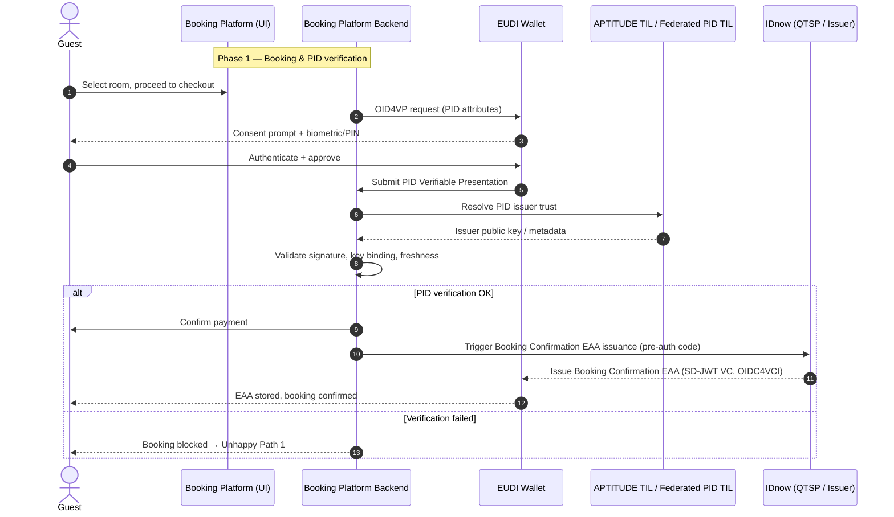
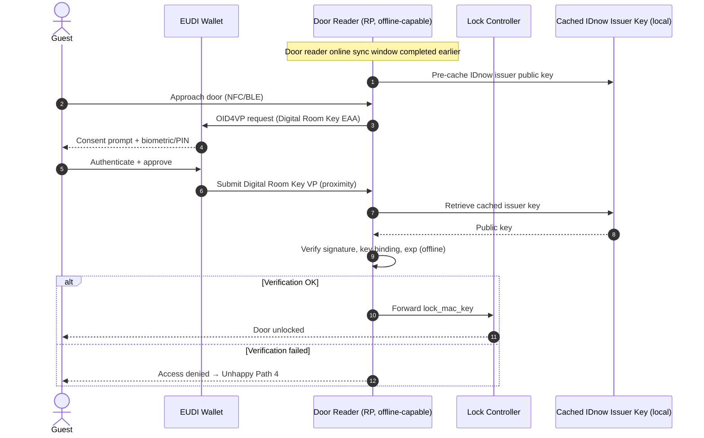

# Annex A.10 — UC 10: Streamlined End-to-End Hotel Booking (IDnow)

**Objective:**
-------------
Enable a fully paperless, privacy-preserving hotel journey — from online booking to room access and legally mandated guest registration — using the European Digital Identity Wallet (EUDIW) as the single carrier of the guest's identity and stay-related credentials. UC 10 demonstrates the combined use of PID with three IDnow-issued Electronic Attestations of Attributes (EAAs) across both online (web) and proximity (QR/NFC/BLE, partly offline) verification flows.

**Use Case Summary**
------------
UC 10 covers the full lifecycle of a hotel stay mediated by the EUDIW: (i) PID-based identity verification at the moment of online booking on a Booking Platform; (ii) issuance by IDnow (acting as QTSP) of a Booking Confirmation EAA bound to the wallet instance; (iii) PID + Booking Confirmation re-verification at hotel check-in; (iv) batch issuance of a short-lived Digital Room Key EAA and a Guest Summary EAA, where the Room Key is presented over NFC/BLE to a door reader that can verify it offline; and (v) discharge of the hotel's legal guest-registration obligation by transmitting the Guest Summary EAA (or a derived presentation) to the competent national authority. All four wallet interactions enforce explicit, per-presentation user consent with biometric or PIN authentication. UC 10 is led by IDnow GmbH and exercised in cooperation with a booking-platform partner, a hotel partner, and the APTITUDE WP2 trust framework.

**UC User Story**
------------
"As a hotel guest, I want to book a hotel room, verify my identity, receive a digital room key, and share the required guest registration data with the competent authority — all through my EUDI Wallet — so that I can enjoy a seamless, privacy-preserving and paperless stay without queuing at reception, carrying a physical ID document, or filling in a paper guest registration form."

Secondary (hotelier) user story:

"As a hotelier, I want to onboard guests, hand over room access, and meet my legal guest-registration duties on the basis of cryptographically verifiable wallet credentials, so that I can reduce front-desk effort, eliminate manual data-entry errors, and demonstrate compliance with national hotel-registration law."

**Actors**
---------
- **User (Guest)**: an EU resident travelling within the EU; holder of an EUDIW with a valid PID (e.g., Anna from Spain, Jonas from Germany).
- **Wallet Provider**: certified EUDIW provider supplying the wallet instance used by the guest (cross-border: at least two Member State wallet providers in scope).
- **PID Issuer**: national PID issuer of the guest's Member State; trust federated via the APTITUDE WP2 trust framework.
- **Relying Party 1 — Booking Platform**: online travel/booking platform; verifies PID at booking time and triggers issuance of the Booking Confirmation EAA.
- **Relying Party 2 — Hotel**: hotel front-desk / check-in system; verifies PID and Booking Confirmation EAA at arrival, triggers batch issuance of Digital Room Key + Guest Summary EAAs.
- **Relying Party 3 — Door Lock / Reader**: proximity verifier at the room door; performs offline verification of the Digital Room Key EAA.
- **Relying Party 4 — Competent Authority**: national authority receiving guest registration data under EU Regulation 2025/12 and national hotel-registration law.
- **Credential Issuer (QTSP)**: IDnow GmbH — issues the Booking Confirmation, Digital Room Key, and Guest Summary EAAs as SD-JWT VCs over OIDC4VCI under a qualified electronic seal.
- **Trust Infrastructure**: APTITUDE pilot Trusted Issuer List (TIL) and federated national TILs.

**Context & Pre-conditions**
---------------
- The guest has installed a certified EUDIW and successfully provisioned a valid PID from their national PID issuer.
- The Booking Platform is integrated with the EUDIW framework and registered as a Relying Party in the APTITUDE pilot trust environment.
- The hotel's check-in system, door reader infrastructure, and authority-reporting interface are integrated with the EUDIW framework and registered RPs.
- IDnow holds a qualified electronic seal certificate usable to sign EAAs, anchored in the pilot TIL.
- The door reader has been provisioned with IDnow's issuer public key (or has a recent online sync window enabling key caching) to support offline verification.
- The competent national authority of the hotel's Member State accepts a wallet-mediated guest registration submission (or a documented equivalent submission path is defined for the pilot jurisdiction).
- For cross-border scenarios: the guest's PID issuer is reachable through the federated TIL accessible to the hotel.

**Credentials involved**
-------------
- **PID (Personal Identification Data)**: family name, given name, date of birth, nationality — used for identity verification at booking (Phase 1) and at check-in (Phase 3).
- **Booking Confirmation EAA** (issued by IDnow): booking reference, hotel identifier, guest identity binding, stay dates, room category. Used at check-in to bind the wallet holder to the booking record.
- **Digital Room Key EAA** (issued by IDnow): room number, lock MAC key (`lock_mac_key`), short-lived `exp` aligned with the stay window. Presented over NFC/BLE to the door reader; supports offline verification.
- **Guest Summary EAA** (issued by IDnow): consolidated guest-registration dataset required under EU Regulation 2025/12 and national transpositions (identity attributes, address, stay dates, hotel identifier). Presented to the competent authority in Phase 5.

**User journey**
--------

_Booking (online)_
1. **Search & select**: The guest selects a room on the Booking Platform.
2. **Identity verification**: At checkout, the platform requests PID via the EUDIW; the guest authenticates and consents.
3. **Payment & EAA issuance**: After payment, IDnow issues the Booking Confirmation EAA into the wallet via OIDC4VCI pre-authorised code flow.

_Check-in (on-site)_
1. **Arrival**: At the kiosk / front desk, the guest scans a QR code presented by the hotel system.
2. **Combined presentation**: The wallet returns a combined VP of PID + Booking Confirmation EAA after consent + biometric authentication.
3. **Match & issue**: The hotel matches PID identity to the booking record, then triggers IDnow to batch-issue the Digital Room Key EAA and the Guest Summary EAA into the wallet.

_Room access (proximity, possibly offline)_
1. **Approach door**: The guest approaches the room door.
2. **Proximity presentation**: The wallet presents the Digital Room Key EAA over NFC/BLE; the reader verifies the issuer signature using its cached IDnow public key, validates key binding and `exp`, and unlocks the door.

_Authority reporting_
1. **Submission**: The hotel forwards the Guest Summary EAA (or a derived presentation) to the competent authority's interface to discharge its registration duty.
2. **Confirmation / fallback**: On success, registration is logged. On failure, the regulatory fallback (manual guest registration) is triggered (see Unhappy Path 3).

**Technical Flow**
--------

_Phase 1: Booking-time PID verification (online)_

1. The Booking Platform initiates an OID4VP request for the PID attribute set required at booking.
2. The wallet prompts the guest for consent and biometric/PIN authentication.
3. The wallet builds the PID Verifiable Presentation and returns it to the platform backend.
4. The platform validates the issuer signature against the federated TIL, validates key binding, and checks freshness.
5. On success, the platform completes payment and triggers IDnow (QTSP) to issue the Booking Confirmation EAA via OIDC4VCI pre-authorised code flow.
6. The wallet stores the EAA and confirms receipt.

_Phase 2: Check-in + batch EAA issuance (on-site, online)_

1. The hotel system displays a QR code encoding an OID4VP request for PID + Booking Confirmation EAA.
2. The wallet returns a combined VP after consent + authentication.
3. The hotel validates both credentials (signatures, key binding, expiry, attribute match against the booking record).
4. On success, the hotel triggers IDnow to batch-issue the Digital Room Key EAA and the Guest Summary EAA in a single OIDC4VCI transaction.
5. Both EAAs are stored in the wallet.

_Phase 3: Door unlock (proximity, offline-capable)_

1. The wallet detects the door reader (NFC/BLE) and receives an OID4VP presentation request scoped to the Digital Room Key EAA.
2. The guest authenticates and approves; the wallet builds the proximity VP.
3. The reader validates the SD-JWT VC signature using the locally cached IDnow issuer public key (offline), validates key binding (`cnf`) and `exp`, and forwards the `lock_mac_key` to the lock controller to unlock the door.

_Phase 4: Authority reporting_

1. The hotel system constructs the authority submission from the Guest Summary EAA (held in the wallet, presented under consent at the moment of check-in or just-in-time).
2. The submission is sent to the competent authority's interface.
3. The authority validates the issuer signature and stay attributes; on success, the registration is logged and the hotel receives an acknowledgement. On failure, the regulatory fallback (manual paper registration) is triggered.

**Unhappy Paths**
-----------
- **Unhappy Path 1 — PID verification fails at booking** (e.g., PID expired, signature invalid, issuer not trusted, user declines consent): booking is blocked or falls back to a non-wallet identity verification path.
- **Unhappy Path 2 — EAA issuance fails** (e.g., IDnow issuance endpoint unavailable, wallet rejects credential, key attestation fails): booking is held; a retry or manual confirmation by the hotel is offered.
- **Unhappy Path 3 — Authority reporting fails or user declines Guest Summary consent**: the hotel falls back to the regulatory fallback process (manual guest registration form) per national hotel-registration law.
- **Unhappy Path 4 — Door reader verification fails offline** (e.g., expired Room Key EAA, key binding failure, cached key outdated): access denied; the guest is directed to reception, where a manual key card is issued and the door reader is force-synced.
- **Unhappy Path 5 — Cross-border PID trust resolution fails** (federated TIL unreachable or guest's PID issuer not federated): the hotel falls back to manual identity check using a physical ID document.

**Success Criteria**
-------
- End-to-end completion of booking → check-in → room access → authority reporting using the EUDIW as the sole identity and credential carrier.
- Correct verification of all IDnow-issued EAAs by the Booking Platform, hotel system, door reader, and authority interface.
- Successful offline verification of the Digital Room Key EAA at the door reader within the booked stay window.
- Successful execution of cross-border scenarios (guest's PID issued in a different Member State from the hotel).
- Explicit, per-presentation user consent enforced at every wallet interaction with no silent data sharing.

**Business KPIs**
----------
- ≥ 5 end-users (test guests) onboarded across the pilot.
- ≥ 3 EAAs integrated (Booking Confirmation, Digital Room Key, Guest Summary), all issued by IDnow as QTSP.
- ≥ 90 % of pilot sessions completed end-to-end without falling back to paper/manual processes.
- Door unlock latency ≤ 2 seconds in offline mode at the reader.
- End-to-end test of a full transaction lifecycle (PID verification → EAA issuance → online verification → proximity verification → authority reporting).

**Testing procedures**
-----------------
- **Functional Testing**: validation of the complete lifecycle from booking-time PID verification through to authority reporting, including batch EAA issuance and offline door-reader verification.
- **Interoperability Testing**: cross-border verification across at least two EUDIW providers, federation against national PID TILs via the APTITUDE WP2 trust framework, and integration with the hotel's door-lock vendor and authority-reporting interface.
- **Offline & Resilience Testing**: dedicated test campaign for the door reader covering offline verification, key rotation handling, and clock-drift scenarios.
- **Usability Tests**: UX/UI validation across all four wallet interactions with a pilot guest group, including consent comprehension and fallback-path clarity.
- **Security Testing**: validation of key binding, replay protection on proximity flows, and resistance to credential cloning.

These procedures will focus on the four wallet interactions defining UC 10 (booking-time PID, check-in PID + Booking Confirmation, door Room Key, authority Guest Summary). The test environment, participant criteria, and exact test data will be finalised together with WP2 and the hotel partner as implementation progresses.

**Legal & regulatory aspects**
---------
UC 10 demonstrates:
- strict adherence to **eIDAS 2.0** and the **ARF** for issuance and presentation of EAAs via the EUDIW, with EAAs signed under a qualified electronic seal by IDnow as QTSP;
- compliance with **GDPR** principles of data minimisation and selective disclosure (only attributes necessary for each phase are requested; no silent or background sharing);
- compliance with **EU Regulation 2025/12** and national transpositions governing hotel guest registration, with the Guest Summary EAA designed to fulfil the legal reporting duty;
- compliance with **national hotel-registration law** of the pilot jurisdiction, including documented fallback to manual registration where wallet-based submission is not available;
- alignment with the **APTITUDE WP2/WP4 regulatory and technical framework**, including the federated trust model and pilot TIL;
- per-presentation user consent with biometric/PIN authentication at all four wallet interactions, and wallet-internal logging accessible only to the user.

**Key challenges and considerations**
----------
- **Cross-border PID trust**: ensuring reliable resolution of multiple national PID issuers via the federated TIL, including handling of attribute-set differences between Member States.
- **Offline verification at the door**: managing key caching, key rotation, and clock synchronisation on door readers that may operate without network connectivity for extended periods.
- **Authority interface heterogeneity**: national authorities differ in their ability to consume wallet-mediated submissions; per-country adapters and/or fallback paths must be defined.
- **Consent UX across four wallet interactions**: avoiding consent fatigue while preserving meaningful, informed consent at each step.
- **Guest-data retention**: aligning hotel-side and authority-side retention with EU Regulation 2025/12 and national hotel-registration law.

**Technical challenges and risks**
----------------
The scenario will face challenges in:
- integrating modern OIDC4VCI / OID4VP protocols with pre-existing Property Management Systems (PMS) and door-lock controllers, which typically rely on proprietary key-distribution mechanisms;
- ensuring reliable batch issuance of the Digital Room Key + Guest Summary EAAs in the time-constrained check-in moment;
- guaranteeing offline verification correctness at the door reader, especially under key-rotation events and `exp` boundaries;
- correctly mapping the Guest Summary EAA attribute set to the heterogeneous national authority interfaces;
- managing wallet-instance binding and key attestation across multiple EUDIW providers.

**Workarounds**: the pilot will be preceded by a dedicated integration and dry-run phase with the booking-platform partner, the hotel partner, and the door-lock vendor to validate end-to-end flows and offline behaviour before exposing test guests to the system. Per-jurisdiction fallback to manual guest registration is defined as a documented workaround for any authority-interface gap.
