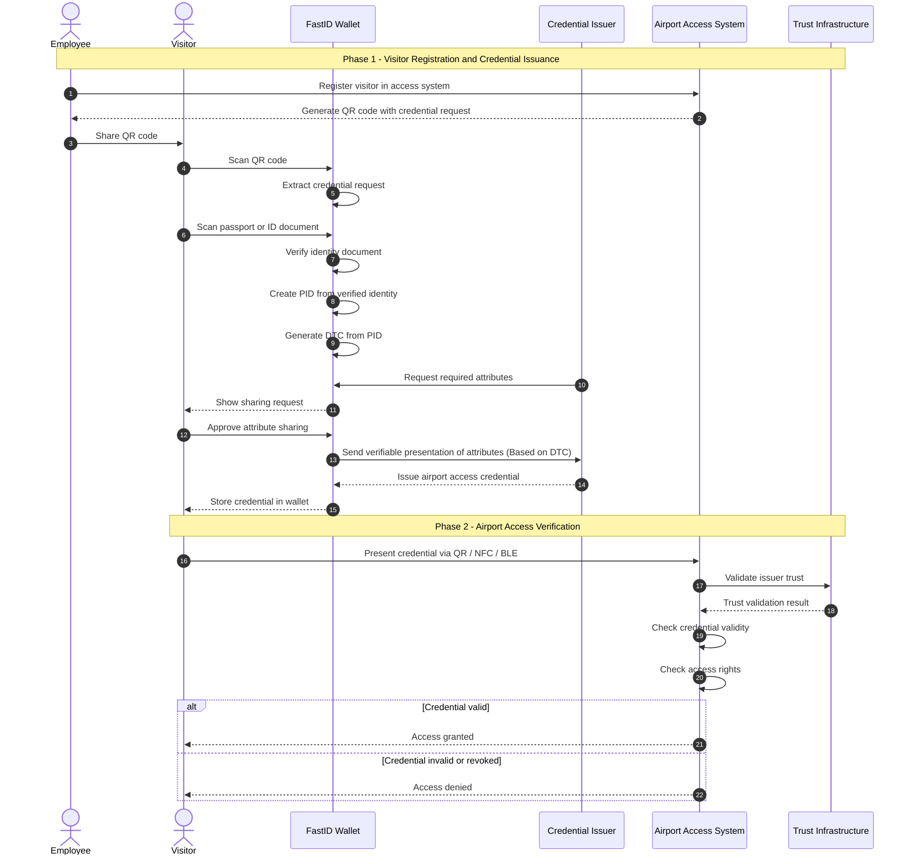

## UC 4: Streamlined Travel Experience (FastID)

#### UC Title
Streamlined Travel Experience for Visitors and Employees

#### UC Domain
Streamlined Travel Experience

### UC Summary

UC4 focuses on the use of wallet credentials for airport access in a controlled Schiphol Lab environment. The scenario looks at how a verified identity can be reused to issue and present access credentials for both visitors and employees entering restricted airport areas.

The flow starts with onboarding the user into the FastID wallet through identity verification using a passport or identity document. Based on this, a PID and DTC are created. An airport access credential is then issued and stored in the wallet.

At the access point, the user presents the credential through QR or proximity sharing. The airport access system validates the credential and checks whether the user has the required access rights before granting access.

The use case demonstrates how wallet identity and access rights can be combined in an airport access flow using EUDI Wallet components.

### User Story

“As an airport employee or visitor, I want to use my wallet credential to access airport areas without depending only on physical badges or repeated manual identity checks.”

### Actors

- **User**: airport employee or visitor using the wallet
- **Wallet Provider**: FastID wallet
- **PID Provider**: provider responsible for identity verification
- **Credential Issuer**: FastID issuing the airport access credential
- **Relying Party**: airport access system in the Schiphol Lab setup

### Context and Preconditions

- The user has installed the FastID wallet.
- The user has completed identity verification.
- A PID and DTC are available in the wallet.
- An airport access credential has been issued.

### Credentials Involved

- PID issued after identity verification
- DTC derived from the PID
- Airport access credential

### User Journey

#### Step 1 – Onboarding

The visitor or employee installs the FastID wallet and verifies their identity using a passport or identity document.

#### Step 2 – Credential Issuance

After identity verification a PID and DTC are created. Based on this information an airport access credential is issued into the wallet.

#### Step 3 – Airport Access

The user arrives at an airport access point and presents the credential using QR or proximity sharing.

The airport system checks the credential validity and access rights before granting or denying access.

### Technical Flow

#### Phase 1 – Identity Verification and Issuance

1. The user starts onboarding through the FastID wallet
2. Identity verification is completed using a passport or identity document
3. A PID is created in the wallet
4. A DTC is generated from the PID
5. The airport credential issuer requests the required attributes
6. The user approves the sharing request
7. The airport access credential is issued and stored in the wallet

#### Phase 2 – Airport Access Verification

1. The user approaches the airport access point
2. The credential is presented through QR or proximity sharing
3. The verifier checks:
   - issuer/wallet trust
   - credential validity
   - access rights
4. Access is granted or denied depending on the result

### Unhappy Paths

1. Identity verification fails during onboarding
2. DTC generation fails
3. Credential issuance fails
4. The wallet cannot present the credential
5. QR or proximity communication fails
6. Credential is expired or revoked
7. Access rights do not match the requested airport area
8. Trust validation fails

### KPIs / Success Criteria

- Successful onboarding and PID creation
- Successful DTC generation
- Successful issuance of airport access credential
- Successful verification at airport access points

### Testing Procedures

- Functional testing of issuance and verification flows
- QR and proximity verification testing
- Revocation and expiration testing
- Controlled pilot testing in the Schiphol Lab setup

### Key Challenges & Considerations

- Integration between wallet flows and airport systems
- Managing access rights for both visitors and employees
- Supporting both remote and proximity verification
- Trust validation within the pilot environment
- Operational usability in airport scenarios

### Technical Challenges & Risks

The scenario may face challenges related to:
- integration between wallet and access systems
- revocation and trust validation
- QR/NFC/BLE reliability
- interoperability between pilot components

Possible workarounds include controlled pilot integrations, simulated trust lists, and staged testing before broader deployment.
